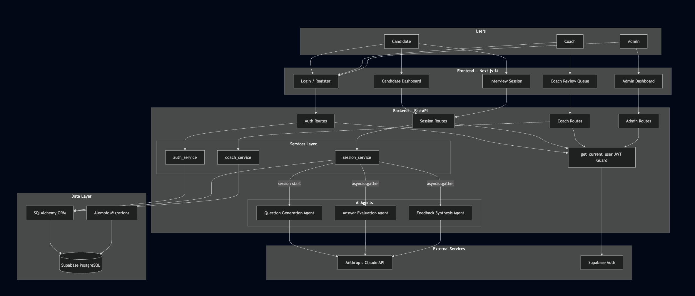

# MockReady

**AI-powered technical interview preparation platform.** Practice with an AI interviewer that generates role-specific questions, evaluates responses across five dimensions, and delivers actionable behavioral feedback. Coaches audit and override AI scores, building ground-truth data that powers a self-improving LLM-as-judge evaluation system.

> Course project — CS Graduate AI Engineering, Northeastern University
> Authors: Xuan Bai, Dhruv Gorasiya

---

## Live demo

🚀 **[mock-ready-inky.vercel.app](https://mock-ready-inky.vercel.app/)**

No local setup needed to grade this. The app is deployed, the backend is live, and the walkthrough below creates everything you need from the hosted UI.

---

## Demo walkthrough (for reviewers / TAs)

MockReady has two user roles — **Candidate** and **Coach** — and you need one of each to see the full loop. Both are created from the same hosted `/register` page; a query-parameter switches between them.

### 1. Create a Candidate account

1. Go to **[/register](https://mock-ready-inky.vercel.app/register)**
2. Pick any email + a password with ≥ 8 characters, 1 uppercase letter, 1 digit (e.g. `Candidate1`)
3. Submit → you're auto-logged-in and land on **`/dashboard`**
4. Click **New Session**, choose an interview type (behavioral / technical / system design) and a role (SWE / PM / DS), and start
5. Answer each question. When you finish the last one the session flips to `completed` and appears on the coach queue.

### 2. Create a Coach account (no DB access required)

> Coach signup is gated by a URL query parameter rather than a separate form. This keeps the public UI simple while still letting reviewers create a coach account on the hosted instance without touching Supabase.

1. Go to **[/register?role=coach](https://mock-ready-inky.vercel.app/register?role=coach)**
2. You must see a **purple "Registering as Coach" badge** next to the page heading — this is the visual confirmation that the `role` param took effect
3. Fill in a different email from your candidate account, same password rules
4. Submit → auto-logged-in and redirected to **`/review`** (the coach queue — not `/dashboard`)

If the purple badge doesn't appear, the URL didn't include `?role=coach` and the account will be created as a candidate. Double-check the URL before submitting.

Admin accounts are deliberately **not** creatable from the public register endpoint. `?role=admin` is silently downgraded to candidate.

### 3. Walk the coach review flow

1. Logged in as the coach, you land on **`/review`** — the queue of every candidate session whose status is `completed` (not yet `reviewed`)
2. Click a session → full detail view: each question, the candidate's answer, the AI's 5-dimension scores, and an override form pre-filled with the AI scores as a starting point
3. Adjust any dimension, optionally add a **Justification**, hit **Submit score**
4. Use **Previous / Next** to walk the questions — the form resets per question so scores and justifications don't leak between them
5. The first override flips the session from `completed` → `reviewed`, so it drops off the queue. The candidate can still view it from their dashboard; it just no longer needs review.

### 4. Things worth trying

- **Log out and back in as each account** — coaches always land on `/review`, candidates on `/dashboard`. The post-login redirect is driven by `GET /api/v1/auth/me`.
- **Stale-token auto-logout** — open DevTools → Application → Local Storage, corrupt `mockready_access_token`, reload. The UI auto-logs-out rather than getting stuck (the `/auth/me` 401 clears the token).
- **Cross-role URL poking** — while signed in as a candidate, navigate to `/review`. The coach layout's auth guard bounces you to `/login`.

---

## What it does

MockReady addresses a gap that existing tools like Leetcode, Pramp, and ChatGPT don't fill: **dimensional, behavioral feedback on explanation quality and communication**, not just correctness.

| Role | What they do |
|---|---|
| **Candidate** | Selects a role and interview type, completes a session, receives per-dimension AI scores with behavioral feedback |
| **Coach** | Reviews AI-scored sessions, overrides scores with justification |
| **Admin** | (planned) Manages the question bank, configures scoring rubrics, monitors AI evaluation drift |

---

## Tech stack

| Layer | Technology |
|---|---|
| Frontend | Next.js 14 (App Router), TypeScript, Tailwind CSS — deployed on Vercel |
| Backend | FastAPI (Python 3.11+) |
| Database | Supabase (PostgreSQL) via SQLAlchemy ORM |
| AI | Anthropic Claude API (`claude-sonnet-4-6`) |
| Auth | JWT (HS256), verified against `SUPABASE_JWT_SECRET` |
| Testing | pytest + pytest-asyncio (backend), Jest + React Testing Library (frontend), Playwright (e2e) |
| Linting | Ruff (Python), ESLint + Prettier (TypeScript) |
| Package mgmt | uv (Python), npm (Node) |

---

## Architecture



Three AI agents run during a session. Each invocation is logged (agent id, input, output, latency, model version, timestamp) for the LLM-as-judge pipeline.

- **Question Generation Agent** — runs on session start; produces role- and type-specific questions
- **Answer Evaluation Agent** — runs on answer submission; returns integer scores 1–10 across 5 dimensions (Clarity, Depth, Structure, Relevance, Communication Quality) plus one-sentence reasoning per dimension
- **Feedback Synthesis Agent** — runs in parallel with Evaluation via `asyncio.gather()`; returns a 2–3 sentence summary, 1–3 sentence behavioral feedback per dimension, and one concrete improvement suggestion

```
Route Handler → Service → asyncio.gather(
    answer_evaluation_agent(...),
    feedback_synthesis_agent(...),
)
```

---

## Scoring system

- **Dimension scores:** integers 1–10
- **Composite score:** weighted average using the active `RubricVersion` for the session's role; falls back to equal 0.2 weights if none is configured
- **Dual scores:** both `ai_score` and `coach_score` are stored. Coach score is authoritative when present. Neither is ever overwritten or deleted — overrides supersede, they do not replace.
- **Rubric weight changes** apply to new sessions only, never retroactively

---

## API reference

All endpoints are under `/api/v1`. Every route except `/health`, `/auth/register`, and `/auth/login` requires `Authorization: Bearer <token>`.

| Group | Route | Notes |
|---|---|---|
| Health | `GET /health` | Liveness probe |
| Auth | `POST /auth/register` | Accepts optional `role: "candidate" \| "coach"` (default candidate). `admin` is rejected with 422. |
| Auth | `POST /auth/login` | Returns a JWT |
| Auth | `GET /auth/me` | Returns the authenticated user's id, email, role, created_at |
| Sessions (candidate) | `POST /sessions` | Creates a session + generates questions |
| Sessions (candidate) | `GET /sessions/history` | Candidate's completed/reviewed sessions |
| Sessions (candidate) | `GET /sessions/trends` | Composite + per-dimension trend over the last 10 sessions |
| Sessions (candidate) | `GET /sessions/{id}` | Scoped to the authenticated candidate |
| Sessions (candidate) | `POST /sessions/{id}/questions/{qid}/answer` | Submit answer; runs eval + feedback agents in parallel |
| Coach | `GET /coach/sessions` | Queue of completed sessions awaiting review |
| Coach | `GET /coach/sessions/{id}` | Full session detail; not scoped by candidate_id |
| Coach | `POST /coach/sessions/{id}/questions/{qid}/score` | Submit override scores + justification; flips session to `reviewed` |

Coach routes return `403 Forbidden` for users whose role is neither `coach` nor `admin`.

---

## Session state machine

```
CREATED → IN_PROGRESS → COMPLETED → REVIEWED
                                ↘ ABANDONED (auto, after 48h idle)
```

- `CREATED` — session record exists, no answers yet
- `IN_PROGRESS` — at least one answer submitted
- `COMPLETED` — all questions answered; appears on the coach queue
- `REVIEWED` — a coach has submitted at least one override; drops off the queue

---

## Running locally

You don't need to do this to grade the project — the hosted demo above exercises every feature. Included for completeness.

**Prerequisites:** Python 3.11+, Node.js 18+, [`uv`](https://github.com/astral-sh/uv), a Supabase project, an Anthropic API key.

Create `backend/.env`:

```env
DATABASE_URL=postgresql+asyncpg://<user>:<password>@<host>:<port>/<db>
SUPABASE_URL=https://<project>.supabase.co
SUPABASE_ANON_KEY=<anon-key>
SUPABASE_SERVICE_ROLE_KEY=<service-role-key>
SUPABASE_JWT_SECRET=<jwt-secret-from-supabase-settings>
ANTHROPIC_API_KEY=<your-key>
DEV_BYPASS_AUTH=false
```

Frontend defaults to `http://localhost:8000` for the backend. To point elsewhere, set `NEXT_PUBLIC_API_URL` in `frontend/.env.local`.

```bash
# Backend (terminal 1)
cd backend
uv sync --extra dev
alembic upgrade head
uv run uvicorn app.main:app --reload --port 8000

# Frontend (terminal 2)
cd frontend
npm install
npm run dev
```

Open `http://localhost:3000`.

---

## Testing

### Backend

```bash
cd backend
uv run pytest app/tests/ -v --cov=app    # full suite with coverage
uv run ruff check .                      # lint
```

Coverage target: >80% on all `services/` and `agents/` modules.
Discipline: **Red → Green → Refactor** — failing tests are committed before their implementation. Visible in git history (`test:` commits precede matching `feat:` commits).

### Frontend

```bash
cd frontend
npm test                 # Jest + React Testing Library
npm run lint             # ESLint + Prettier
npx tsc --noEmit         # type check
```

### End-to-end

```bash
cd frontend
npx playwright test      # requires backend + frontend dev servers running
```

---

## Repository layout

```
/
├── frontend/                # Next.js app (deployed on Vercel)
│   ├── app/
│   │   ├── (candidate)/     # Candidate routes — dashboard, new session, interview, session detail
│   │   ├── (coach)/         # Coach routes — review queue, session review
│   │   ├── login/
│   │   └── register/        # Accepts ?role=coach
│   ├── components/session/  # Candidate UI
│   ├── components/coach/    # CoachScoreForm
│   ├── lib/api/             # Typed REST clients
│   ├── lib/auth/            # AuthContext — token, user, /auth/me hydration, auto-logout on 401
│   └── __tests__/           # Jest + RTL
├── backend/
│   ├── app/api/v1/          # auth.py, sessions.py, coach.py, health.py
│   ├── app/agents/          # question_generation, answer_evaluation, feedback_synthesis, logging_utils
│   ├── app/models/          # SQLAlchemy ORM models
│   ├── app/schemas/         # Pydantic request/response schemas
│   ├── app/services/        # Business logic (session, coach, auth)
│   ├── app/core/            # config, db, security (JWT)
│   ├── app/tests/           # pytest
│   └── alembic/             # Migrations
├── docs/                    # PRD, architecture, security, testing, commands, sprints
└── CLAUDE.md                # AI-assisted development instructions
```

---

## Security

- All secrets read from environment variables. No credentials in source.
- JWT validation on every protected route via the `get_current_user` FastAPI dependency.
- Role-based access: `/api/v1/coach/*` requires `role` ∈ {`coach`, `admin`}. Candidates receive `403`.
- Candidates can only read sessions they own — `get_session_detail` scopes by `candidate_id`.
- All database access goes through SQLAlchemy ORM. Raw SQL is never constructed from user input.
- User input is sanitized before being passed to any LLM prompt.
- CORS origins are explicitly allowlisted (production Vercel URLs + `localhost:3000`).
- CI gates: [Gitleaks](https://github.com/gitleaks/gitleaks) secrets scan, `npm audit --audit-level=critical`, and a dedicated security reviewer agent on new routes.
- Full OWASP Top 10 coverage documented in [`docs/security.md`](docs/security.md).

---

## Documentation

| File | Contents |
|---|---|
| [`docs/PRD.md`](docs/PRD.md) | Full product requirements, user stories, acceptance criteria |
| [`docs/architecture.md`](docs/architecture.md) | Architecture decisions and patterns |
| [`docs/security.md`](docs/security.md) | OWASP coverage, CI security gates |
| [`docs/testing.md`](docs/testing.md) | Testing strategy and TDD conventions |
| [`docs/conventions.md`](docs/conventions.md) | Code style and naming conventions |
| [`docs/commands.md`](docs/commands.md) | All dev commands in one place |
| [`docs/demo_script.md`](docs/demo_script.md) | Walkthrough script for the demo video |
| [`CLAUDE.md`](CLAUDE.md) | Instructions for AI-assisted development |
| [`tasks/todo.md`](tasks/todo.md) | Current sprint task tracking |
